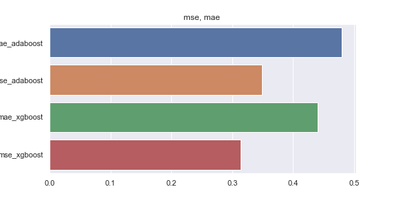

## Credit score calculation 

To reproduce same results 

``` 
git clone https://github.com/MotiBaadror/credit-risk-modeling-with-LDPs
cd credit-risk-modeling-with-LDPs
pip install - r requirements.txt 
python cutboost_trial.py or xgboost_trail.py
```

Loss Metric used: mean_squar_error, mean_absolute_error

Below is the comparison for both the algorithm Adaboost, and XGBoost regressor




